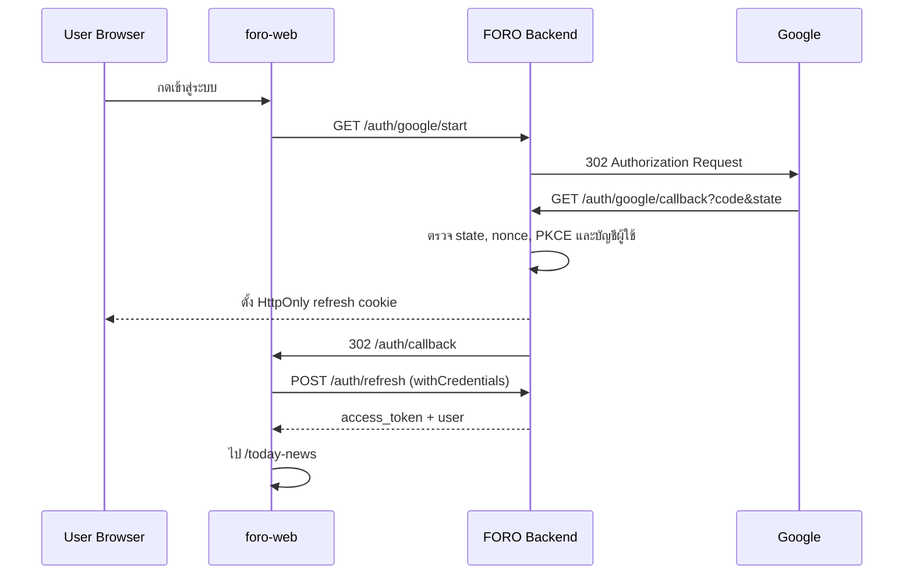

# FORO Google OAuth — Backend Handoff

เอกสารนี้เป็น contract ระหว่าง `foro-web` และ backend สำหรับการเข้าสู่ระบบด้วย Google
ฝั่ง frontend พร้อมเรียก flow นี้เมื่อกำหนด `VITE_GOOGLE_AUTH_ENABLED=true`

> ขอบเขต: backend เป็นผู้ติดต่อ Google และเก็บ Client Secret ทั้งหมด ห้ามส่ง Google Client Secret,
> authorization code, Google token หรือ FORO access token ผ่าน URL หรือให้ frontend จัดการ

## 1. เป้าหมายและ Flow

ผู้ใช้ที่ยังไม่ล็อกอินกด CTA บน Landing แล้วไปหน้า Google โดยไม่ผ่านหน้า `/login` ของ FORO



Frontend ยังคงหน้า `/login` เดิมไว้เป็น fallback แต่จะไม่มีลิงก์จาก Landing เมื่อเปิด Google OAuth

## 2. Google Cloud Console

1. สร้าง Google Cloud project สำหรับ development/testing แยกจาก production
2. ตั้ง OAuth audience เป็น `External` และสถานะ `Testing`
3. เพิ่ม Google accounts ที่ใช้ทดสอบในรายการ Test users
4. สร้าง OAuth Client ประเภท `Web application`
5. ขอ scope เท่าที่จำเป็นเท่านั้น:
   - `openid`
   - `email`
   - `profile`
6. เพิ่ม Authorized redirect URI ให้ตรงกับ `GOOGLE_OAUTH_REDIRECT_URI` ทุกตัวอักษร รวม scheme,
   port, path และ trailing slash

ตัวอย่าง local:

```text
http://localhost:8080/api/v1/auth/google/callback
```

เอกสารอ้างอิง:

- [Google OAuth 2.0 for Web Server Applications](https://developers.google.com/identity/protocols/oauth2/web-server)
- [Google OpenID Connect](https://developers.google.com/identity/openid-connect/openid-connect)
- [Authlib FastAPI OAuth Client](https://docs.authlib.org/en/latest/client/fastapi.html)

Flow นี้เป็น server-side redirect จึงไม่ต้องนำ Client Secret หรือ Google SDK มาใส่ใน frontend

## 3. Backend Environment

เพิ่ม key ต่อไปนี้ใน backend เท่านั้น ตัวอย่างทั้งหมดเป็น placeholder:

```env
GOOGLE_OAUTH_CLIENT_ID=<google-web-client-id>
GOOGLE_OAUTH_CLIENT_SECRET=<google-web-client-secret>
GOOGLE_OAUTH_REDIRECT_URI=http://localhost:8080/api/v1/auth/google/callback
FRONTEND_URL=http://localhost:5173
OAUTH_SESSION_SECRET=<random-secret-used-only-for-oauth-session>
COOKIE_SECURE=false
COOKIE_SAMESITE=lax
```

ข้อกำหนด:

- Backend ต้อง fail fast ตอน start หาก Google config ไม่ครบ แต่ห้าม log ค่าของ secret
- Production ต้องใช้ HTTPS และ `COOKIE_SECURE=true`
- แนะนำให้ frontend/backend production อยู่ภายใต้ site เดียวกัน เช่น `foro.world` และ
  `api.foro.world` เพื่อให้ refresh cookie ทำงานสม่ำเสมอ
- `OAUTH_SESSION_SECRET` ต้องแยกจาก Google Client Secret และไม่ commit ลง Git

## 4. Dependencies และ OAuth Client

เพิ่ม Authlib (และ `itsdangerous` หาก dependency tree ยังไม่มี) แล้วใช้ Starlette
`SessionMiddleware` กับ FastAPI:

- Session cookie ต้องเป็น HttpOnly, อายุสั้นประมาณ 10 นาที และ `SameSite=Lax`
- ใช้ Google OpenID discovery document
  `https://accounts.google.com/.well-known/openid-configuration`
- client scopes คือ `openid email profile`
- เปิด PKCE แบบ `S256`
- ให้ Authlib เก็บและตรวจ `state`/`nonce` ใน temporary OAuth session

ห้ามใช้ Google access token เป็น FORO access token ระบบต้องสร้าง FORO JWT ชุดเดิมหลังยืนยันตัวตนแล้ว

## 5. API Contract

ทุก path ด้านล่างต่อท้าย `{API_BASE}` เช่น `http://localhost:8080/api/v1`

### 5.1 เริ่ม Google Login

```http
GET /auth/google/start
```

- Public endpoint ไม่ต้องมี Bearer token
- ไม่รับ `return_to` จาก client เพื่อป้องกัน open redirect
- สร้าง state, nonce และ PKCE challenge ใหม่ทุกครั้ง
- ตอบ `302` ไป Google authorization endpoint
- Authorization request ต้องใช้ `GOOGLE_OAUTH_REDIRECT_URI`

### 5.2 Google Callback

```http
GET /auth/google/callback?code=<google-code>&state=<state>
```

Backend ต้องทำตามลำดับ:

1. ถ้า Google ส่ง `error` ให้แปลงเป็น safe error code และกลับ frontend
2. ตรวจ state และนำ authorization code ไปแลก token พร้อม PKCE verifier
3. ตรวจ ID token signature, issuer, audience, expiry และ nonce
4. ต้องมี `sub`, `email` และ `email_verified=true`
5. ทำ user linking/provisioning ใน transaction
6. สร้าง FORO refresh token/session ด้วยกลไกเดิม โดยให้ access token ถูกออกจาก `/auth/refresh`
7. เก็บ hash ของ refresh token ตามระบบเดิม
8. ตั้ง refresh token บน `RedirectResponse` เป็น HttpOnly cookie
9. Redirect ไป frontend โดยไม่แนบ token

Success:

```http
HTTP/1.1 302 Found
Set-Cookie: refresh_token=<opaque-value>; HttpOnly; SameSite=Lax; Path=/
Location: {FRONTEND_URL}/auth/callback
```

Failure:

```http
HTTP/1.1 302 Found
Location: {FRONTEND_URL}/auth/callback?error=<safe_error_code>
```

Safe error codes ที่ frontend รองรับ:

| Code | ความหมาย |
|---|---|
| `access_denied` | ผู้ใช้ยกเลิกหรือไม่อนุญาต |
| `oauth_failed` | provider/token validation ล้มเหลว |
| `email_unverified` | Google ไม่ยืนยันอีเมล |
| `account_disabled` | พบบัญชี FORO แต่ถูกระงับ |

ห้ามส่ง exception message, Google response, code, token หรือ email ใน query string

### 5.3 สร้าง Frontend Session

ใช้ endpoint เดิม:

```http
POST /auth/refresh
Cookie: refresh_token=<http-only-cookie>
```

Response:

```json
{
  "access_token": "<foro-access-token>",
  "token_type": "bearer",
  "user": {
    "id": "123",
    "name": "Example User",
    "email": "user@example.com",
    "role": "user",
    "phone": null
  }
}
```

`user.phone` ต้องเป็น `string | null` เพราะ Google ไม่ส่งเบอร์โทรศัพท์ใน scope ชุดนี้

## 6. User Linking และ Database Migration

ปรับ `users` table:

| Column | การเปลี่ยนแปลง |
|---|---|
| `google_sub` | เพิ่ม string, nullable, unique และ indexed |
| `password` | เปลี่ยนเป็น nullable สำหรับ Google-only user |
| `phone` | คง nullable และไม่สร้างข้อมูลปลอม |

ลำดับการค้นหา/สร้างบัญชี:

1. ค้นด้วย `google_sub` ก่อน เพราะเป็น Google account identifier ที่เสถียร
2. หากไม่พบ ให้ค้นด้วย normalized verified email
3. หากอีเมลตรงกับ user เดิม ให้เติม `google_sub` โดยรักษา `id`, `role`, `status` และข้อมูลเดิมทั้งหมด
4. หากไม่พบ ให้สร้าง user ใหม่: `role="user"`, active status ตามค่า default, `password=null`,
   `phone=null` และใช้ display name จาก Google
5. หาก user ถูกปิดใช้งาน ให้คืน `account_disabled` และห้ามสร้าง session

ต้องมี unique constraint ที่ `google_sub` และ email พร้อมจัดการ `IntegrityError`/race condition:
เมื่อ callback พร้อมกันชน constraint ให้ rollback แล้วอ่าน user เดิมกลับมา ห้ามสร้าง duplicate

ไม่ต้องเก็บ Google access token, refresh token หรือ ID token หลัง callback เพราะ FORO ใช้ Google เพื่อยืนยันตัวตนเท่านั้น

## 7. Legacy Login Compatibility

ช่วง rollout ต้องเก็บ endpoints เดิม:

- Password login: หาก `password is null` ให้ตอบ generic invalid credentials ห้ามเรียก password verifier ด้วย null
- Register: email ที่มีอยู่แล้วจาก Google ต้องถือว่าซ้ำ
- Forgot password: Google-only user ไม่ควรสร้างรหัสผ่านผ่าน flow เดิม ให้ตอบข้อความกลางว่าต้องเข้าสู่ระบบด้วย Google
- Logout: ล้าง refresh token hash และ delete cookie ด้วย `path`, `domain`, `secure`, `samesite` ที่ตรงกับตอน set
- ห้ามแก้ role ของ user เดิมเมื่อเชื่อม Google account

## 8. Cookie และ CORS

Local:

```text
HttpOnly=true
Secure=false
SameSite=Lax
Path=/
Allowed origin=http://localhost:5173
Allow credentials=true
```

Production:

```text
HttpOnly=true
Secure=true
SameSite=Lax เมื่อ frontend/backend เป็น same-site
Path=/
Allowed origins เป็นรายการ frontend HTTPS ที่ระบุชัดเจน
Allow credentials=true
```

ห้ามใช้ `Access-Control-Allow-Origin: *` ร่วมกับ credentials หาก frontend/backend จำเป็นต้องอยู่คนละ site
ต้องออกแบบ cookie policy และทดสอบ browser ก่อนเปิด production

## 9. Security และ Logging

- ตรวจ state, nonce, PKCE และ ID token claims ทุกครั้ง
- ใช้ HTTPS ใน production
- จำกัดอายุ temporary OAuth session และล้างข้อมูล state หลัง callback
- ป้องกัน open redirect โดยใช้ `FRONTEND_URL` จาก config เท่านั้น
- ห้าม log authorization code, access token, refresh token, ID token, cookie หรือ Client Secret
- Log ได้เฉพาะ safe error code, request/correlation id และผลสำเร็จโดยไม่ใส่ PII
- จำกัด rate ของ `/auth/google/start` และ callback ตามสมควร

## 10. Backend Tests

ต้อง mock Google discovery/token endpoints ไม่เรียก Google จริงใน automated tests

| Scenario | Expected result |
|---|---|
| Start endpoint | 302 และมี scope/state/nonce/PKCE/redirect URI ถูกต้อง |
| State หรือ nonce ผิด | ไม่สร้าง user/session และ redirect `oauth_failed` |
| Google access denied | redirect `access_denied` |
| Email ไม่ verified | redirect `email_unverified` |
| Google user ใหม่ | สร้าง user role `user`, password/phone เป็น null |
| Verified email ตรง user เดิม | เชื่อม `google_sub`, id/role/data เดิมไม่เปลี่ยน |
| Callback ซ้ำ/พร้อมกัน | มี user เดียว ไม่เกิด duplicate |
| Account disabled | ไม่สร้าง session และ redirect `account_disabled` |
| Success callback | ตั้ง HttpOnly refresh cookie และไม่ใส่ token ใน Location |
| Refresh | คืน access token และ user ที่ `phone` เป็น null ได้ |
| Legacy password user | login เดิมยังสำเร็จ |
| Google-only password login | ตอบ generic invalid credentials โดยไม่เกิด 500 |
| Logout | ล้าง DB hash และ cookie ด้วย attributes ที่ตรงกัน |

## 11. Backend Ready Checklist

แจ้ง frontend ว่าเปิด flag ได้เมื่อครบทั้งหมด:

- [ ] Google development client และ test users พร้อม
- [ ] `/auth/google/start` redirect สำเร็จ
- [ ] `/auth/google/callback` ตรวจ state/nonce/PKCE/claims ครบ
- [ ] Migration รันบนฐานข้อมูลทดสอบผ่าน
- [ ] New user, existing-email linking และ disabled user ผ่าน tests
- [ ] Callback ตั้ง refresh cookie และ `/auth/refresh` อ่าน cookie ได้จาก frontend origin
- [ ] CORS เปิดเฉพาะ origin ที่กำหนดและ allow credentials
- [ ] Error redirect ใช้เฉพาะ safe error codes
- [ ] ไม่มี secret/token/code ใน URL หรือ logs
- [ ] ส่งค่า API base URL และ callback URI ที่ใช้จริงให้ผู้ดูแล Google Consoleตรวจซ้ำ

เมื่อพร้อม ฝั่ง frontendตั้งค่า:

```env
VITE_GOOGLE_AUTH_ENABLED=true
```

## 12. Production Follow-up

ก่อนเปิดผู้ใช้ทั่วไป:

- สร้าง Google Cloud production project/client แยกจาก testing
- ใช้ HTTPS และ production redirect URI ที่ตรงทุกตัวอักษร
- มีหน้า Privacy Policy แบบ public URL สำหรับ OAuth consent screen
- ยืนยัน domain/branding และทำขั้นตอน verification ที่ Google กำหนด
- ทดสอบ cookie บน production domain และ browser หลัก
- เริ่มจาก test users/small rollout และเก็บอัตรา OAuth failure โดยไม่ log PII

## 13. Prompt สำหรับส่งให้ Codex ฝั่ง Backend

คัดลอกข้อความด้านล่างไปใช้ในโปรเจกต์ backend ได้เลย:

```text
Implement Google OAuth/OpenID Connect for the FORO FastAPI backend by following
docs/API_DOCUMENTATION_GOOGLE_AUTH.md from the foro-web handoff.

Requirements:
- Work only in the backend repository.
- Add Authlib-based server-side Authorization Code flow with state, nonce and PKCE S256.
- Add GET /auth/google/start and GET /auth/google/callback under the existing API prefix.
- Keep the existing FORO access-token/refresh-cookie architecture.
- On successful callback, set the HttpOnly refresh cookie and redirect to
  {FRONTEND_URL}/auth/callback. Never put any token or Google code in a frontend URL.
- Add a migration for nullable unique users.google_sub and nullable users.password.
- Link by google_sub first, then by verified email, preserving existing id/role/data.
- Create new Google users with role=user, password=null and phone=null.
- Keep password login/register/forgot-password as compatible fallback paths.
- Update response schemas so phone may be null.
- Configure exact CORS origins and environment-aware cookie attributes.
- Add automated tests for all scenarios in the Backend Tests section with Google mocked.
- Do not reveal or commit real credentials. Do not log codes, tokens, cookies or PII.
- Run the backend test suite and migration checks, then report the exact start/callback
  paths and the Backend Ready Checklist results to the frontend project.
```
