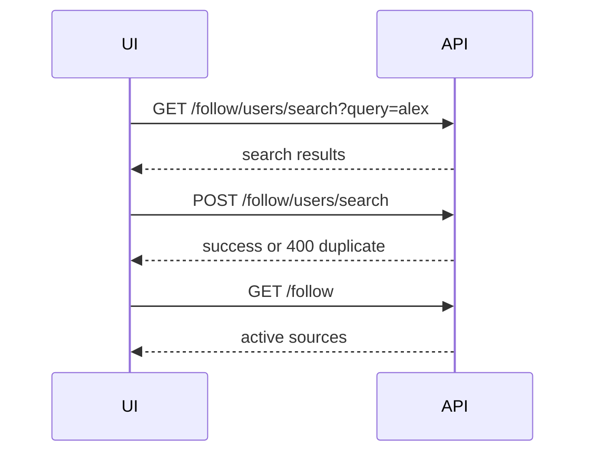
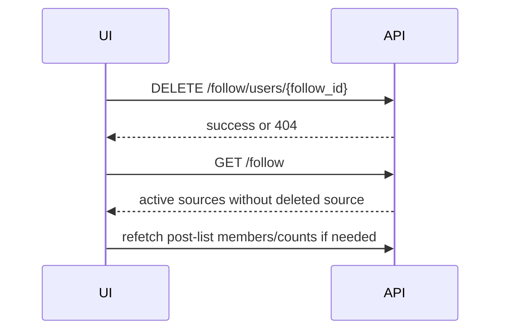

# User Follow Frontend Contract

เอกสารนี้สรุป contract ระหว่าง frontend กับ backend สำหรับการ follow / unfollow แหล่งข่าวของ user

ตัวอย่าง endpoint ใช้ base path ตาม local/prod ปัจจุบัน:

```http
/api/v1
```

ทุก endpoint ในเอกสารนี้ต้องส่ง Bearer token:

```http
Authorization: Bearer <access_token>
```

## Data Model

`follow_user` หมายถึงแหล่งข่าวที่ user ติดตาม ไม่ได้จำกัดเฉพาะ X account แล้ว

```ts
type FollowType = "x" | "rss";

type FollowSource = {
  id: number;
  x_account: string | null;
  follow_type: FollowType;
  source_url: string | null;
  status: number;
  name: string | null;
  profile_image_url_https: string | null;
  user_id: number;
  created_at: string;
  updated_at: string;
};
```

Frontend ควรใช้ `id` เป็น key หลักสำหรับ follow/unfollow และเพิ่ม source เข้า post list

## Display Rules

| follow_type | title | subtitle | avatar |
|---|---|---|---|
| `x` | `name || x_account` | `@${x_account}` | `profile_image_url_https` |
| `rss` | `name || source_url` | `source_url` | `profile_image_url_https || RSS fallback icon` |

ข้อควรระวัง:

- อย่า assume ว่าทุก source มี `x_account`
- `x_account` จาก backend จะถูก normalize เป็น lowercase และไม่มี `@` เช่น `@AlexXuByte` จะถูกเก็บเป็น `alexxubyte`
- ใช้ `follow_type` แยก UI และ action ของ X/RSS

## Get Follow Sources

```http
GET /api/v1/follow
```

คืนเฉพาะ follow source ที่ active (`status = 1`)

Response:

```json
[
  {
    "id": 9,
    "x_account": "alexxubyte",
    "follow_type": "x",
    "source_url": null,
    "status": 1,
    "name": "Alex Xu",
    "profile_image_url_https": "https://...",
    "user_id": 2,
    "created_at": "2026-05-12T06:40:00Z",
    "updated_at": "2026-05-12T06:40:00Z"
  },
  {
    "id": 12,
    "x_account": null,
    "follow_type": "rss",
    "source_url": "https://example.com/rss.xml",
    "status": 1,
    "name": "Example News",
    "profile_image_url_https": null,
    "user_id": 2,
    "created_at": "2026-05-12T06:42:00Z",
    "updated_at": "2026-05-12T06:42:00Z"
  }
]
```

Frontend หลัง follow/unfollow สำเร็จควร refetch endpoint นี้

## Search X Users

ใช้สำหรับ autocomplete/search ก่อนกด follow

```http
GET /api/v1/follow/users/search?query=alex&cursor=<optional_cursor>
```

Response เป็น wrapper จาก Twitter API service:

```json
{
  "status": "success",
  "data": {
    "query": "alex",
    "cursor": null,
    "users": {}
  }
}
```

Frontend ควร map user ที่เลือกออกมาเป็น payload ของ Add X Account

## Add X Account

```http
POST /api/v1/follow/users/search
Content-Type: application/json
```

Request:

```json
{
  "x_account": "alexxubyte",
  "query": "alex",
  "name": "Alex Xu",
  "profile_image_url_https": "https://..."
}
```

ส่ง `x_account` แบบมีหรือไม่มี `@` ก็ได้ backend จะ normalize ให้

Success:

```json
{
  "status": "success",
  "data": {
    "x_account": "alexxubyte",
    "name": "Alex Xu",
    "profile_image_url_https": "https://...",
    "result": {
      "id": 9,
      "x_account": "alexxubyte",
      "follow_type": "x",
      "source_url": null,
      "status": 1,
      "name": "Alex Xu",
      "profile_image_url_https": "https://...",
      "user_id": 2,
      "created_at": "2026-05-12T06:40:00Z",
      "updated_at": "2026-05-12T06:40:00Z"
    }
  }
}
```

Duplicate behavior:

- backend เช็กซ้ำด้วย `user_id + follow_type = "x" + status = 1 + x_account`
- ถ้า account นั้น active อยู่แล้ว จะตอบ `400`
- ถ้าเป็น account อื่น จะไม่โดน block จาก follow รายการอื่น

Duplicate error:

```json
{
  "detail": {
    "status": "error",
    "data": {
      "status_code": 400,
      "message": "คุณได้ติดตาม @alexxubyte ไปแล้ว"
    }
  }
}
```

Limit error:

```json
{
  "detail": {
    "status": "error",
    "data": {
      "status_code": 400,
      "message": "คุณสามารถติดตามได้สูงสุด 50 คนเท่านั้น ปัจจุบันติดตาม 50 คนแล้ว",
      "current_follows": 50,
      "max_follows": 50
    }
  }
}
```

## Preview RSS Feed

ใช้ validate RSS ก่อน follow

```http
GET /api/v1/follow/rss/preview?rss_url=https%3A%2F%2Fexample.com%2Frss.xml
```

Success:

```json
{
  "status": "success",
  "data": {
    "feed_url": "https://example.com/rss.xml",
    "feed_title": "Example News",
    "items": []
  }
}
```

## Add RSS Feed

```http
POST /api/v1/follow/rss
Content-Type: application/json
```

Request:

```json
{
  "rss_url": "https://example.com/rss.xml",
  "name": "Example News",
  "profile_image_url_https": null
}
```

Success response เป็น `FollowSource`:

```json
{
  "id": 12,
  "x_account": null,
  "follow_type": "rss",
  "source_url": "https://example.com/rss.xml",
  "status": 1,
  "name": "Example News",
  "profile_image_url_https": null,
  "user_id": 2,
  "created_at": "2026-05-12T06:42:00Z",
  "updated_at": "2026-05-12T06:42:00Z"
}
```

Duplicate behavior:

- backend เช็กซ้ำด้วย `user_id + follow_type = "rss" + status = 1 + source_url`
- ถ้า RSS feed active อยู่แล้ว จะตอบ `400`

## Unfollow Source

ใช้ endpoint เดียวกันทั้ง X และ RSS โดยส่ง `follow.id`

```http
DELETE /api/v1/follow/users/{follow_id}
```

Success:

```json
{
  "status": "success",
  "data": {
    "message": "หยุดติดตาม เรียบร้อยแล้ว"
  }
}
```

Not found:

```json
{
  "detail": {
    "status": "error",
    "data": {
      "status_code": 404,
      "message": "ไม่พบการติดตาม หรือเคยหยุดติดตามไปแล้ว"
    }
  }
}
```

Frontend หลัง unfollow สำเร็จควร:

- remove source นั้นออกจาก UI หรือ refetch `GET /api/v1/follow`
- refetch post-list membership ถ้าหน้านั้นแสดงจำนวนสมาชิกใน list
- invalidate cache ของ advanced search source picker ถ้ามี

## Unfollow Side Effects

เมื่อ user unfollow source:

1. backend ลบ mapping ใน `post_list_user` ที่อ้างถึง `follow_id` นั้นก่อน
2. backend ลบ record ใน `follow_user`
3. source นั้นจะไม่อยู่ใน `GET /api/v1/follow`
4. source นั้นจะไม่ถูกใช้ใน future fetch/search/analyze จาก followed users หรือ post list อีก

ผลกับ post list:

- ถ้า source อยู่ใน post list ใด ๆ จะถูกถอดออกจากทุก post list ของ user คนนั้น
- frontend ที่แสดง count/member list ควร refetch หลัง unfollow

ผลกับข่าวเดิม:

- ข่าวใน `news_items` ไม่ได้มี foreign key ไปหา `follow_user`
- การ unfollow จะไม่ลบข่าวเก่าที่เคย fetch/analyze ไว้
- ข่าวเก่ายังอยู่ใน `GET /api/v1/news` จนกว่า user จะลบข่าวนั้นเองผ่าน `DELETE /api/v1/news/{news_id}`
- การ unfollow มีผลกับการดึงข่าวใหม่ในอนาคต ไม่ใช่การล้าง history

เหตุผลที่ไม่ลบข่าวเก่าอัตโนมัติ:

- ข่าวเป็น history/content ที่ user เคยสร้างไว้แล้ว
- ถ้าลบตาม follow อาจทำให้ bookmark/category/filter history หายโดยไม่ตั้งใจ
- ตอนนี้ `news_items` ผูกกับ `user_id` เป็นหลัก ไม่ได้ผูกกับ `follow_user.id`

ถ้า product ต้องการ UX แบบ "unfollow แล้วซ่อนข่าวเก่าของ source นี้ด้วย" ให้ทำเป็น feature แยก เช่น:

- เพิ่ม filter ฝั่ง frontend เพื่อซ่อนข่าวจาก source ที่ไม่ได้ follow แล้ว
- เพิ่ม backend endpoint สำหรับ archive/delete news by source
- เพิ่ม field ใน `news_items` เช่น `source_follow_id` หรือ `source_account` เพื่อ filter ได้แม่นขึ้น

## Recommended Frontend Flow

Add X:



Unfollow:



## UI Copy Suggestions

Follow duplicate:

```text
คุณติดตาม @alexxubyte อยู่แล้ว
```

Unfollow confirm:

```text
หยุดติดตามแหล่งข่าวนี้?
แหล่งข่าวนี้จะถูกถอดออกจากทุก list แต่ข่าวเดิมที่เคยบันทึกไว้จะยังอยู่
```

Unfollow success:

```text
หยุดติดตามแล้ว
```

Unfollow failure:

```text
ไม่พบรายการติดตามนี้ อาจถูกลบไปแล้ว
```

